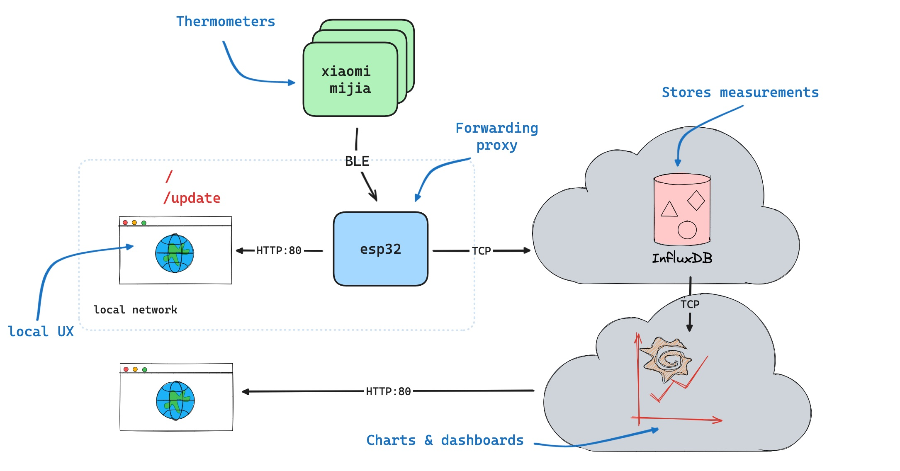
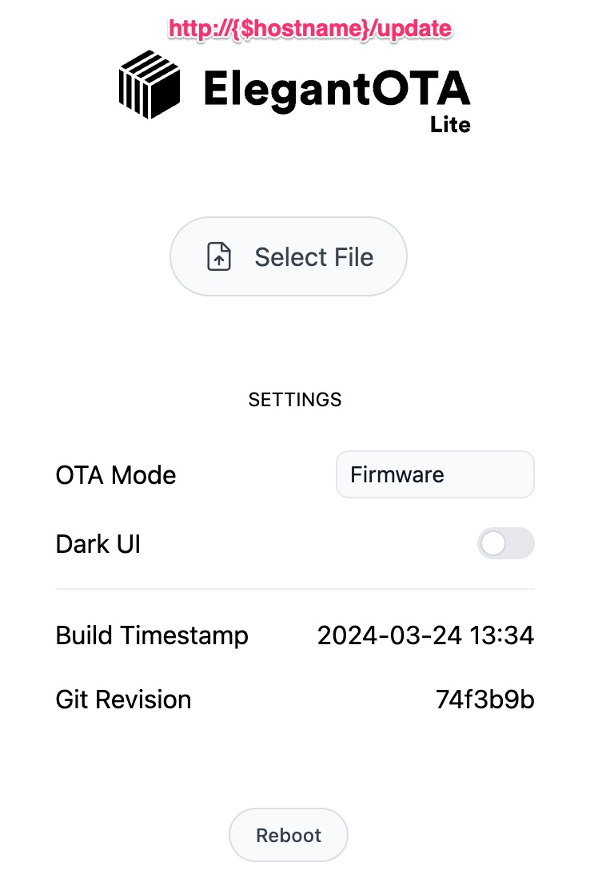
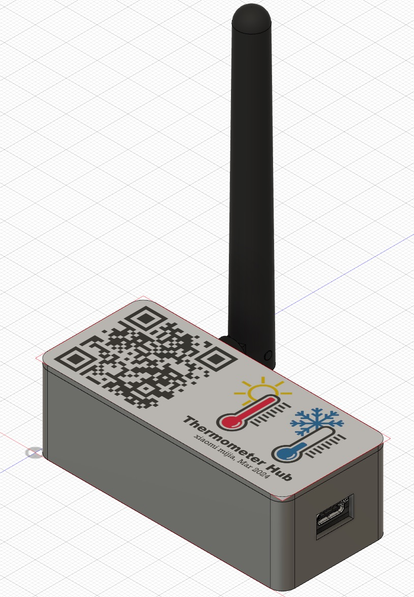

# BLE to WIFI Thermometers Hub

## Description
ESP32 based project. It collects themperatures and humidity data over Bluetooth (BLE) from [xiaomi mijia thermometers](Xiaomi-Mijia-Bluetooth-Thermometer-Hygrometer-2-Temperature-Humidity-Sensor-Smart-Digital-LCD-Moisture-Meter-Thermo-Hygrometer.jpg) and forwards it to [InfluxDB cloud](https://www.influxdata.com/products/influxdb-cloud) service free tier. [Grafana cloud service](https://grafana.com) is used for charts.

ESP32runs a webserver on port 80 for a local API and OTA firmware updates.

There is a custom partition file [partitions_custom.csv](partitions_custom.csv) to reduce spiffs size, otherwise code does not fit.

The OTA functionality is modified [ElegantOTA](https://github.com/ayushsharma82/ElegantOTA). If you want to make changes to UI - edit [index.html](lib/ElegantOTA/src/index.html) to you liking. This script (populate_progmem.py)[populate_progmem.py] runs on every build to copy/encode the index.html into PROGMEM

## How it works


Local wifi credentials, InfluxDB tokens etc stored in [include/credentials.h](include/credentials.h). Edit `include/credentials_example.h` and copy it into `include/credentials.h`
 
## Local API

`GET http://<hostname>/` 

returns a JSON like this
```
[{
        "mac": "a4:c1:38:17:35:30",
        "timestamp": 1711390037,
        "temperature": 19.8,
        "humidity": 58,
        "batt_voltage": 2.929,
        "batt_level": 80,
        "rssi": -82
    },
    {
        "mac": "a4:c1:38:47:00:1c",
        "timestamp": 1711390071,
        "temperature": 15.5,
        "humidity": 58,
        "batt_voltage": 2.948,
        "batt_level": 83,
        "rssi": -79
    },
    {
        "mac": "a4:c1:38:52:31:ff",
        "timestamp": 1711390073,
        "temperature": 18.1,
        "humidity": 62,
        "batt_voltage": 3.111,
        "batt_level": 100,
        "rssi": -61
    }
]
```

`GET http://<hostname>/update` 

Over-the-air update UI looks like this




`POST http://<hostname>/reboot` 

restarts ESP32

## Fabrication


[3d model](enclosure.f3z)

[top cover design](top-design.kra)